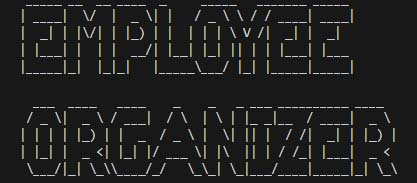
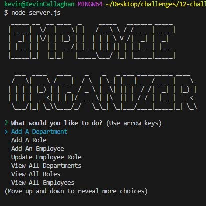

# Organize-My-Business-With-Employee-Organizer

## Description

The Employee Organizer was created to allow a business owner to be able to view and manage the departments, roles, and employees in their company so that they can organize and plan their business.  By running this program in the terminal, the business owner can add a new department, add a new role, add a new employee, update an employee role, view all departments, view all roles, and view all employees.

## Table of Contents

- [Installation](#installation)
- [Usage](#usage)
- [Credits](#credits)
- [License](#license)

## Installation

Employee Organizer requires Inquirer, MySQL2, DotENV, and Figlet.

These are included in the package.json, so to use the Organizer simply open the terminal and run 'npm i' to install the required dependencies.

## Usage

Link to Video Example: https://watch.screencastify.com/v/Mer8TfGoHg8Ah3sYEHlA 

Before using Employee Organizer, you must install the dependencies as mentioned above.  From there, run 'node server.js' to start the Employee Organizer.  Once it has loaded, you can interact with the Organizer to accomplish your managerial tasks!

Here is a screenshot of the loaded application:

To Add a Department, select "Add a Department" and hit enter.  When prompted, enter the new Department Name and hit enter to add.

To Add a new Role, select "Add a Role" and hit enter. When prompted, enter the new Role's Title, then hit enter.  When prompted, enter the Role's new salary, then hit enter.  When prompted, select the new Role's department from the existing departments, then hit enter.

To Add a new Employee, select "Add An Employee" and hit enter.  When prompted, enter the new Employee's first name, then hit enter.  When prompted, enter the new Employee's last name, then hit enter. When prompted, select the new Employee's role from the existing roles, then hit enter.  When prompted, select the Manager for the new Employee from the list of existing employees, then hit enter.

To Update an Employee's Role, select "Update Employee Role" and hit enter. When prompted, select the Employee you would like to update from the list of existing employee's, then hit enter. When prompted, select the new Role to be assigned to the selected Employee, then hit enter.

To View All Departments, select "View All Departments" and hit enter.

To View All Roles, select "View All Roles" and hit enter.

To View All Employees, select "View All Employees" and hit enter.

To Exit the application, select "Exit Employee Organizer" and hit enter.

## Credits

1. I used the article from MDN Web Docs to figure out the structure of Switch Case and break.  Here is the link to the article: https://developer.mozilla.org/en-US/docs/Web/JavaScript/Reference/Statements/switch 

2. I used figlet to create the ASCII art.  This Github repo from the user 'Patorjk' has tutorials for implementing figlet that I used: https://github.com/patorjk/figlet.js/ 

3. I used w3schools.com documentation for Node.js MYSQL.  Here are the pages I used:
    <ul>
    <li><a href="https://www.w3schools.com/nodejs/nodejs_mysql_insert.asp">Node.js MySQL Insert</a></li>
    <li><a href="https://www.w3schools.com/nodejs/nodejs_mysql_update.asp">Node.js MySQL Update</a></li>
    <li><a href="https://www.w3schools.com/nodejs/nodejs_mysql_select.asp">Node.js MySQL Select</a></li>
    </ul>

## License

MIT LICENSE

For additional license information, please refer to the LICENSE file in the repository